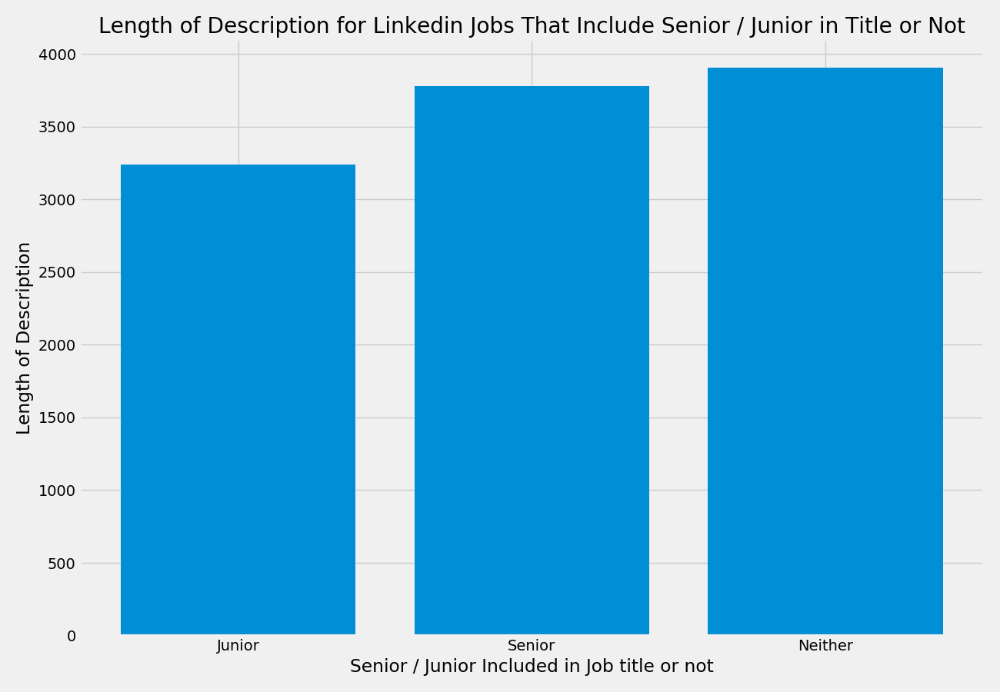

# Data_science_job_market_analysis_project

# Background:
According to Glassdoor.com, a reputable job review website, data science has been the best job in America for several years (source: https://www.glassdoor.com/List/Best-Jobs-in-America-LST_KQ0,20.htm). The pay is great, the satisfaction rating is high, and the technology is cutting edge. It almost sounds too good to be true. Although there have been several analyses on the data science job market(e.g. https://www.pwc.com/us/en/library/data-science-and-analytics.html), analyses regarding the current jobs available - especially locally here in Denver - are hard to come by. The goal of this project was to find trends among currently available jobs and try to find some insights into the job market.

# The Data:
Using selenium and beautiful soup, two popular python packages for web scraping and web automation, two datasets were scraped; one from Indeed.com (n = 3969) and another from Linkedin.com (n = 3150).

### Features from each dataset:
| Indeed job features    | Linkedin job features  |
| ---------------------- | ---------------------- |
| Company name           | Company name           |
| Job title              | Job title              |
| Location               | Location               |
| Easy apply feature     | Number of applicants   |
| Company rating         | Full job description   |
| Job summary            |                        |

### Indeed web scraping process:
The job summary from Indeed only included a few lines of the full job description. Because many Indeed jobs redirect you to the company's website for more information regarding the job, scraping that information would have required parsing several sites rather than just one. Linkedin, on the other hand, does not redirect you to the company's website and instead has the job summary accessible by clicking on each job.

Scraping job features from Indeed was much simpler than scraping Linkedin. Job searches on Indeed return several pages of jobs. For each of the pages, the entire HTML can be pulled into a Beautiful Soup object to parse the page. Once one obtains the Beautiful Soup object, parsing through the HTML is as simple as finding the HTML tags and attributes that contain the information desired. To deal with the issue of multiple pages, a function was created that would return the last page of a search given the initial search result URL. Once this function returned the last page, a list was created to represent the number of pages (1 to last page). Going through each page number within that list and placing it into the URL yields a list of URLs to parse.

Features of interest were obtained by finding the HTML tag that contained the feature and searching through that tag for the attribute that represented the feature. Example code for finding the location of a job on Indeed is:

```
for div in soup.find_all('div', attrs={'class': 'recJobLoc'}):
        loc = div['data-rc-loc']
```

This code will use a Beautiful Soup object (soup) to find all div tags that have the class attribute recJobLoc. Within that div, the location can be found within the attribute data-rc-loc.

### Linkedin web scraping process:
To scrape Linkedin, selenium needed to be used. Beautiful soup is not enough for linkedin because one needs to click on the jobs in order to get the job information. Beautiful soup could have been used to scrape basic information such as job title and company name but because the site doesn't redirect users to the company's website, the full job description was available. In order to get this more detailed information, one needs to be able to interact with the site like a human user. Selenium's strong point is just this; that it allows one to write code that will interact with the website like a human user. Two main features of selenium that allow this are the ability to click on buttons and the ability to type in text to text fields.

In order to scrape Linkedin, the script first would navigate to the search result page and clicked on the 'see more jobs' button a given number of times allowing one to have access to more than just one page. The script then clicked on each job and passed the HTML to a beautiful soup object that then was used to parse for the information of interest.

# Analysis:

## Linkedin
The first variable of interest was the length of the job description. I wanted to see if jobs that included senior (or Sr.) in the title had longer or shorter descriptions than jobs that included junior (or Jr.) in the title or jobs that didn't include either in the title.



As is shown in the graph, junior jobs had on average the shortest length of description. This was followed by senior level jobs and the longest descriptions tended to be jobs that didn't include senior or junior in the title. The graph shows that these three categories of jobs have different lengths of descriptions, but the question still remains as to whether these differences are big enough to be considered 'real' differences. In other words, we still don't know if these differences are real or if they are likely due to error.

A one way ANOVA was used to test the hypothesis that there are differences in average description length between the three groups (senior, junior, and neither). The omnibus ANOVA model was non-significant indicating that any differences are likely due to chance, *F*(2, 3148) = 1.47, *p* = 0.23. The sample size is so large that it's surprising that these differences are non-significant.

It looks like although the total sample size is large, there were only a small portion of jobs that included either junior or senior in the job title. Senior level jobs represented 16.32% of the jobs, junior level jobs represented 0.41% of the jobs, and 83.27% of jobs didn't include either word in the title. This might explain why the differences found were non-significant; because there wasn't a large enough portion of the jobs that included senior or junior in the title. What about the difference between senior level jobs and all other jobs? Because about 16% of jobs were senior, the sample size may be large enough to observe a significant difference.

The hypothesis that there was a differnece in average length of description between senior jobs and non-senior jobs was tested using an indendent samples t-test. The two means were not significantly different, *t*(3148) = 1.47, *p* = 0.14.
