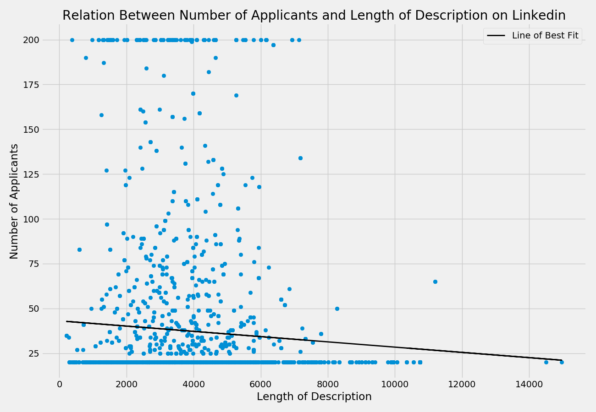
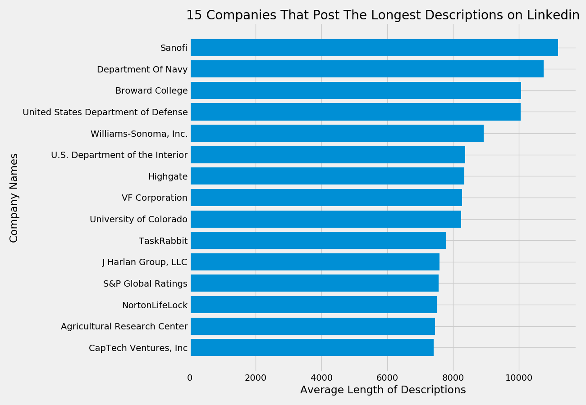
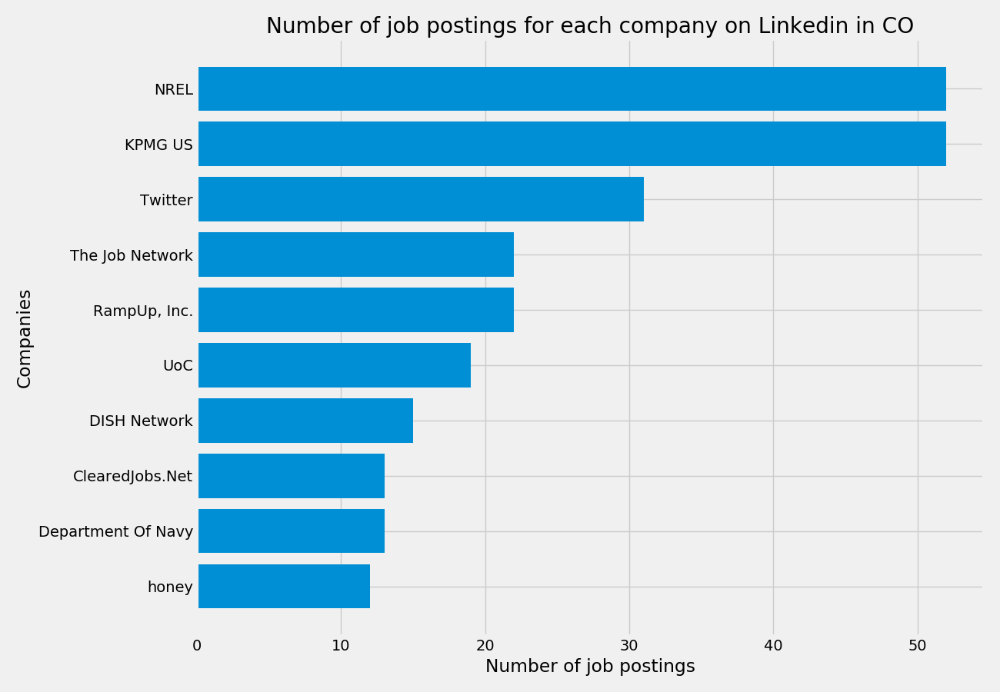
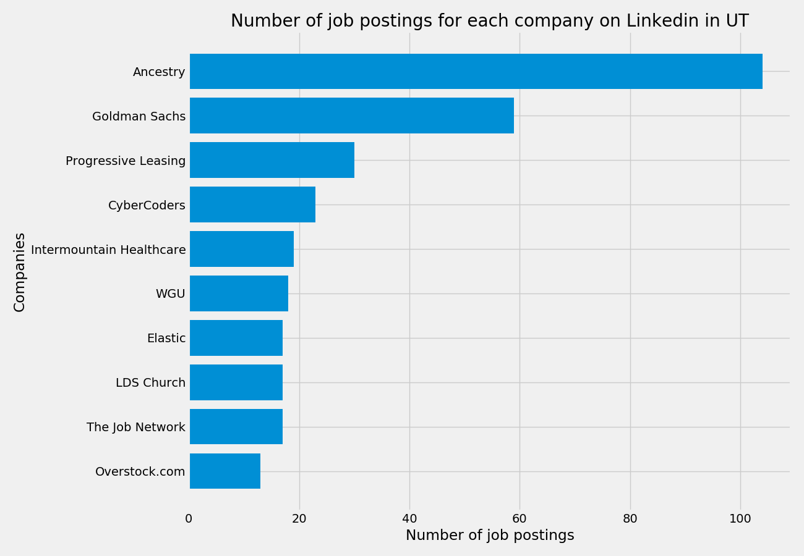

# Data_science_job_market_analysis_project

# Background:
According to Glassdoor.com, a reputable job review website, data science has been the best job in America for several years (source: https://www.glassdoor.com/List/Best-Jobs-in-America-LST_KQ0,20.htm). The pay is great, the satisfaction rating is high, and the technology is cutting edge. It almost sounds too good to be true. Although there have been several analyses on the data science job market(e.g. https://www.pwc.com/us/en/library/data-science-and-analytics.html), analyses regarding the current jobs available - especially locally here in Denver - are hard to come by. The goal of this project was to find trends among currently available jobs and try to find some insights into the job market.

# The Data:
Using selenium and beautiful soup, two popular python packages for web scraping and web automation, two datasets were scraped; one from Indeed.com (n = 3969) and another from Linkedin.com (n = 3150). Each search looked at jobs that resulted from looking up 'Data Science'. This search term yielded the largest number of jobs from the search terms tested.

### Features From Each Dataset:
| Indeed job features    | Linkedin job features  |
| ---------------------- | ---------------------- |
| Company name           | Company name           |
| Job title              | Job title              |
| Location               | Location               |
| Easy apply feature     | Number of applicants   |
| Company rating         | Full job description   |
| Job summary            |                        |

 For both Indeed and Linkedin, six states were selected as states that are hubs for data science jobs. Data was scraped from each of these states.

 | States        |
 | ------------- |
 | Colorado      |
 | California    |
 | Florida       |
 | New York      |
 | Utah          |
 | Washington    |

### Example of Linkedin data:

<table border="1" class="dataframe">
  <thead>
    <tr style="text-align: right;">
      <th></th>
      <th>Job_Title</th>
      <th>Company</th>
      <th>Location</th>
      <th>Number_of_Applicants</th>
      <th>Description</th>
    </tr>
  </thead>
  <tbody>
    <tr>
      <td>0</td>
      <td>Data Acquisition Developer</td>
      <td>ABB</td>
      <td>Broomfield, CO, US</td>
      <td>Be among the first 25 applicants</td>
      <td>Join ABB and work in a team that is dedicated ...</td>
    </tr>
    <tr>
      <td>1</td>
      <td>DATA SCIENTIST MANAGER</td>
      <td>Pilgrim's</td>
      <td>Greeley, CO, US</td>
      <td>Be among the first 25 applicants</td>
      <td>Pilgrim’s is the second largest chicken produc...</td>
    </tr>
    <tr>
      <td>2</td>
      <td>Data Scientist – Logistics Optimization Algori...</td>
      <td>ShaleApps</td>
      <td>Denver, CO, US</td>
      <td>Be among the first 25 applicants</td>
      <td>Location: Denver, CO – Relocation Offered. Rem...</td>
    </tr>
  </tbody>
</table>
</div>

### Indeed web scraping process:
The job summary from Indeed only included a few lines of the full job description. Because many Indeed jobs redirect you to the company's website for more information regarding the job, scraping that information would have required parsing several sites rather than just one. Linkedin, on the other hand, does not redirect you to the company's website and instead has the job summary accessible by clicking on each job.

Scraping job features from Indeed was much simpler than scraping Linkedin. Job searches on Indeed return several pages of jobs. For each of the pages, the entire HTML can be pulled into a Beautiful Soup object to parse the page. Once one obtains the Beautiful Soup object, parsing through the HTML is as simple as finding the HTML tags and attributes that contain the information desired. To deal with the issue of multiple pages, a function was created that would return the last page of a search given the initial search result URL. Once this function returned the last page, a list was created to represent the number of pages (1 to last page). Going through each page number within that list and placing it into the URL yields a list of URLs to parse.

Features of interest were obtained by finding the HTML tag that contained the feature and searching through that tag for the attribute that represented the feature. Example code for finding the location of a job on Indeed is:

```
for div in soup.find_all('div', attrs={'class': 'recJobLoc'}):
        loc = div['data-rc-loc']
```

This code will use a Beautiful Soup object (soup) to find all div tags that have the class attribute recJobLoc. Within that div, the location can be found within the attribute data-rc-loc.

### Linkedin web scraping process:
To scrape Linkedin, selenium needed to be used. Beautiful soup is not enough for linkedin because one needs to click on the jobs in order to get the job information. Beautiful soup could have been used to scrape basic information such as job title and company name but because the site doesn't redirect users to the company's website, the full job description was available. In order to get this more detailed information, one needs to be able to interact with the site like a human user. Selenium's strong point is just this; that it allows one to write code that will interact with the website like a human user. Two main features of selenium that allow this are the ability to click on buttons and the ability to type in text to text fields.

In order to scrape Linkedin, the script first would navigate to the search result page and clicked on the 'see more jobs' button a given number of times allowing one to have access to more than just one page. The script then clicked on each job and passed the HTML to a beautiful soup object that then was used to parse for the information of interest.

### Example of Linkedin job:


### Example of html:


# Analysis:

## Linkedin
The first variable of interest was the length of the job description. I wanted to see if jobs that included senior (or Sr.) in the title had longer or shorter descriptions than jobs that included junior (or Jr.) in the title or jobs that didn't include either in the title.


As is shown in the graph, junior jobs had on average the shortest length of description. This was followed by senior level jobs and the longest descriptions tended to be jobs that didn't include senior or junior in the title. The graph shows that these three categories of jobs have different lengths of descriptions, but the question still remains as to whether these differences are big enough to be considered 'real' differences. In other words, we still don't know if these differences are real or if they are likely due to error.

A one way ANOVA was used to test the hypothesis that there are differences in average description length between the three groups (senior, junior, and neither). The omnibus ANOVA model was non-significant indicating that any differences are likely due to chance, *F*(2, 3148) = 1.47, *p* = .23. The sample size was so large that it's surprising that these differences are non-significant.

It looks like although the total sample size was large, there were only a small portion of jobs that included either junior or senior in the job title. Senior level jobs represented 16.32% of the jobs, junior level jobs represented 0.41% of the jobs, and 83.27% of jobs didn't include either word in the title. This might explain why the differences found were non-significant; because there wasn't a large enough portion of the jobs that included senior or junior in the title. What about the difference between senior level jobs and all other jobs? Because about 16% of jobs were senior, the sample size may be large enough to observe a significant difference.

The hypothesis that there was a difference in average length of description between senior jobs and non-senior jobs was tested using an indendent samples t-test. The two means were not significantly different, *t*(3148) = 1.47, *p* = .14.

No evidence that job level (senior or junior) was associated with description length, but what about number of applicants? It could be the case that people tend to prefer jobs with shorter (or longer) job descriptions and choose to apply to those more often. A scatter plot was created to help visualize this question.



It looks like there was a small negative correlation between number of applicants and length of description in the sense that as as number of applicants increases, the length of description tends to decrease slightly. It was strange that there are so many job descriptions at exactly 20 and so many at exactly 200. This is because Linkedin only gives the exact number of applicants if the number of applicants is between 25 and 200. If it is under 25, it just says that it is under 25. Similarly, if it is over 200, it just says that it is over 200. Although there is this issue, let's see if this correlation is significant.

The association between number of applicants and length of description was significantly negatively correlated, *r*(3148) = -.07, *p* < .001. The sample size was so large here that even the small effect was significant. Although the effect size was small, we can be confident that this effect was not due to chance. Let's see what this looks like if we take out the jobs that had applicants less than 25 and over 200.


It still looks like there was a small negative correlation between these two features. Let's test if this correlation is still significant even though we have decreased our sample size substantially. Once the jobs that had under 25 applicants as well as the jobs that had over 200 applicants were taken out, the correlation was no longer significant, *r*(802) = -.01, *p* = .68. Not only did the correlation become non-significant, but the effect size decreased as well. Interesting!

Next, I wanted to find the top 15 companies that tended to post long job descriptions measured by the number of characters in the description.



It looks like many of these long job postings were posted by the US government (e.g. Department of Navy, USDoD). These job postings likely include some sort of requirement of government clearance and thus will have more sections than most jobs do.

Finally, I wanted to investigate which companies tended to have the largest number of data science jobs. These are companies that should be targetted if one is looking to get a job in data science due to the number of available positions.


Across all states, Amazon had the largest number of jobs by quite a long shot. The runner up, The Job Network, is not a company hiring but rather another job searching website. I'm sure that Linkedin probably isn't too happy with another job searching site posting on their site. However, it seems like The Job Network has a large number of data science jobs.

Looking across all states is nice for someone who doesn't know where they want to work but what about the people who have a state targetted and want to know what the job market is looking like in that state? Let's create a series of graphs that look at the top 10 companies that had posted the largest number of jobs for a couple of the states.



In Colorado, where I'm most interested in searching, NREL and KPMG take the lead by a long shot. 



Interestingly enough, in Utah, the LDS church is hiring a lot of data scientists. It seems like most of their jobs involve investigating people's ancestry.

# Natural Language Processing:

In order to go further into analyzing the descriptions, natural language processing was utilized. Specifically, I wanted to see which skills were most frequently mentioned in the descriptions. In order to accomplish this goal, a list of descriptions was created from the dataframe. Each description was looped over in order to remove stopwords and punctuation. 

Each description was then lemmatized which means that words that are similar are grouped together. The lemmatization process would change 'words' to 'word' and 'running' to 'run' which is essentially just transforming words into their stems. Additionally, lemmatization will change words such as 'better' to 'good' which essentially groups words semantically as well. This allows for a better representation of counts because words that are highly similar will be counted regardless of tense or small differences in wording.

After lemmatizing the descriptions, they were transformed into a python dictionary in which the keys represented each unique word and the value represented the count of that word across all Linkedin descriptions. Finally, two linked lists were created - one which consisted of every unique word sorted in descending order by their counts across the descriptions and another list which consisted of the corresponding count of that word.

After creating these lists, I was able to find the index of certain terms of interest which represented the ranked order of that term. If a term was ranked first, it was the most frequent word across all the descriptions.

A table of the terms of interest as well as their associated rank order and the frequency of that term is shown below:

|Terms      |Rank Order   |Frequency   |
|-----------|-------------|------------|
| Python    |     54      |     2538   |
| SQL       |     71      |     2335   |
| Statistics|     82      |     2158   |
| R         |     107     |     1811   |
| Cloud     |     109     |     1796   |
| ML        |     203     |     1139   |
| Spark     |     314     |     830    |
| BI        |     340     |     733    |
| Pandas    |     1359    |     135    |
| Docker    |     1396    |     130    |
| Numpy     |     1984    |     73     |
| SPSS      |     2270    |     58     |

Many of the high ranked terms, such as 'data' which was ranked first, is not shown here because the focus was on popular skills and tools needed by data scientists. This table can be used by prospective data scientists to help them understand what tools they will need to be most familiar with in order to align well with career requirements.

# Conclusion:
In conclusion, there weren't many associations between the features I investigated. Having said that, even non-significant results can be interesting because not finding evidence of these assocations is telling in and of itself. Let's go back over some of the highlights of this project.

TLDR:

* Web scraping is fun and in Python can be very versitile
    * Also it might drive you crazy
* No association between job level (senior, junior, or neither) and length of description
* Small assocation between length of description and number of applicants
    * No evidence was found to suggest that people prefer jobs with shorter descriptions
    * This small association dropped out when the data was cleaned properly
* We saw many of the companies that post the highest number of jobs
    * Should expect the highest probability of getting jobs at those companies holding subset of data science constant
* We saw the companies that post the highest number of jobs in both Colorado and Utah
    * Learned that Mormons love data scientists
    * Saw the companies in Colorado that we might want to target if we are looking for a career
* Finally, we saw some common skills and tools used in data science and saw where they rank in their occurance across the descriptions
